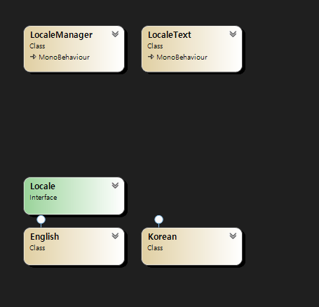

# Unity Locale Practice

## 구조

1. LocaleManager파일에서 LocaleText 컴포넌트가 담겨진 게임 오브젝트를 먼저 가져옴.

   1.1 만약 드롭다운이 있다면 드롭다운에 언어목록 정보를 추가함.

2. LocaleText 파일에 담겨진 targetKey와 LocaleManager에 있는 key를 기준으로 언어 파싱을 시도
3. 만약 Locale 파일에 있는 LocaleKeyTypes enum 사이에 있는 index라면 LocaleManager의 locale의 인스턴스를 languages 폴더에 들어간 각 언어에 맞게 새로 인스턴스화
4. 언어 정보가 변경되었다면 LocaleText 게임오브젝트에 있는 Text나 TextMeshPro의 text를 변경하도록 시도.
